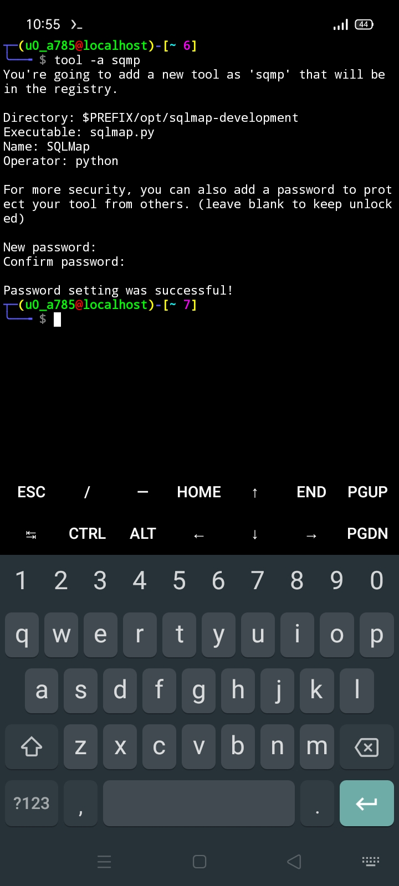

# Tool Manager
__Manage your tools easily with fashionable commands! 🎽__


## Notes
__I am currently working on this to achieve them:__

- __Adding new features.__
- __Making it more flexible.__
- __Terrible bug fixes.__

__So, check for updates regularly when you get free time! And thanks for your attention! 😉__

> It's mainly useful for `termux` users and unpacked tools in `linux`. Unpacked tools are those tools that haven't packaged and can't install by package manager like `apt`, `dnf` etc. Needs to install manually using `git` or other softwares and needs to manually execute them.

## Requirements
- __Linux installed device.__
- __Python `3.8+` releases.__
> Currently works best in version __3.11.6__, but it can work properly in upper and downer versions that I don't know...

## Installation
__Run those commands one by one. (only in `termux`)__
```
pkg --check-mirror install python wget -y
```
```
source <(curl -fsSL https://raw.githubusercontent.com/devwithsd/tool-manager/main/setup.py)
```
__If one of any command fails, then copy, paste and run them from the start.__

## Usage
> I'm currently in `termux` installed `Android Phone`.

__Suppose, you have a tool (using `sqlmap` tool) in `$PREFIX/opt/sqlmap-development` folder, and the executable file is `sqlmap.py`. Let's register it as `sqmp`.__


__Then let's start adding the tool...__

__Adding a tool:__
```
tool -a sqmp
```
__Then you can see like this:__


__Fill in them like this:__



__Where the form means:__
- __"Directory" - the directory of the tool.__
- __"Executable" - the executable file of the tool.__
- __"Name" - name of the tool.__
- __"Operator" - tool executor, `sqlmap` needs `python` to run.__

__I have entered "123" as password.__

__Let's use it:__

__Viewing informations about the tool:__
```
tool -i sqmp
```
__Running a tool:__
```
tool -l sqmp
```

__Then authenticate with the set password: "123".__


__Working with arguments... You need to quote with commas to use arguments:__
```
tool -l "sqmp=--version"
```

__It will look like this:__


__Removing a tool:__
```
tool -r sqmp
```
__Then pass the test with the password "123" and hit enter.__


__That's all. It currently supports in `termux` environment. If this project gets at least one user, then I will start giving updates of it...__


## Conclusion
__This is my first project, so it's a bit silly. So, forgive me for it. I have worked for 2 days. But if you help me, I can make it more flexible and advanced. Give it a star if you like my idea and sorry for my bad `English` grammar. If you're using it, so many thanks to you, let me know that you are a user of this tool at my `Gmail` address. And, till then, goodbye 👋.__